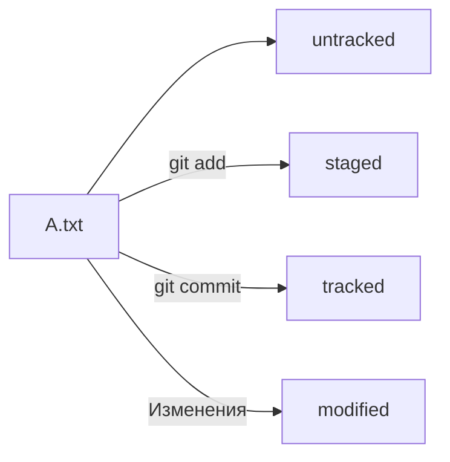
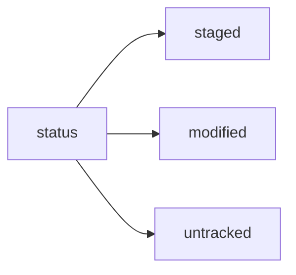

# Шпаргалка по Git
___
### Знакомство с Git
Git - это один из примеров системы контроля версий: он позволяет хранить, изменять и анализировать историю проекта.

Система контроля версий, или VCS (SCM), — программа, позволяющая контролировать изменения в проекте.

Git — незаменимый в команде инструмент, ведь он помогает объединять результаты работы нескольких человек.

---
### Установка Git для Windows
1. Перейдите на [официальную страницу Git](https://git-scm.com/download/win).
2. Скачайте Git for Windows для вашей системы.
3. Запустите программу установки.
4. Проверьте, что в списке устанавливаемых программ стоит галочка напротив пункта Git Bash Here — это позволит открывать консоль с Git в любой папке.
5. После окончания установки нажмите *finish*.
---
### Git на Linux
1. Перейдите на [официальную страницу Git](https://git-scm.com/book/en/v2/Getting-Started-Installing-Git).
2. Следуйте указанным иструкциям.
___
### Запуск Git Bash на Windows

Запустите программу Git Bash. Сделать это можно двумя способами. Можно ввести название программы в окно поиска на панели задач. А можно открыть директорию, в которую был установлен Git.
Обычно это директория 
*C:\Program Files\Git\bin*.

Перейдите в bin и запустите файл *bash.exe.* Откроется консоль. Если вы видите консоль, значит, установка прошла успешно.

---
### Запуск терминла Linux для работы с Git
Запустить терминал на Linux можно комбинацией клавиш - *Ctrl+Alt+T* или с помощью графического интерфейса запуститть программу *Терминал*.
___
### Знакомство с командной строкой
У программ есть привычный графический интерфейс (англ. Graphical User Interface, или GUI). Это окна, значки, кнопки, выпадающее меню с настройками и прочие элементы.


*Командная строка* (англ. Command-line Interface, или CLI) — тоже интерфейс, только текстовый. Пользователь вводит в неё команды. Она принимает их от пользователя и выполняет. Эта строка — обычная программа на вашем компьютере. Такая же, как, например, браузер, в котором вы читаете этот урок.


Чтобы создать папку, вы чаще всего нажимаете правую кнопку мыши и выбираете нужный пункт в графическом меню. Но это можно сделать и через командную строку — достаточно ввести соответствующую команду и имя папки.
Командную строку часто называют терминалом или консолью. Эти термины пришли из тех времён, когда компьютеры выглядели совсем не так, как сейчас. У них не было привычного интерфейса. Вводить данные или вызывать программы можно было только через специальные устройства: терминалы и консоли. С их помощью происходило взаимодействие человека с компьютером.


Но и сегодня многие программы изначально пишут в виде консольных приложений — и лишь затем у них появляется графический интерфейс. Это удобно, ведь у некоторых компьютеров, например у серверов в центрах обработки данных, нет GUI. Консоль помогает взаимодействовать с ними.

*Git* — это программа, которая в том числе может работать из командной строки. Любой графический интерфейс для Git всего лишь преобразует клики пользователя в вызовы программы.
___
### Первые шаги
Если вы пользователь Windows, запустите программу Git Bash.
В открывшемся окне вы увидите:
- имя вашего компьютера;
- имя, под которым вы авторизовались в компьютере;
- символ доллара ($) — он означает, что программа ждёт ваших команд.
В зависимости от операционной системы порядок компонентов и внешний вид строки могут немного различаться.
Так это будет выглядеть в Windows и Linux.
**userName@ComputerName ~**

В графическом интерфейсе всегда ясно, где именно вы находитесь в файловой системе. Если перед вами рабочий стол, значит, вы в папке «Рабочий стол». Если открыта папка «Документы» — вы в ней. В командной строке вы тоже всегда находитесь в какой-то папке — просто этого не видно. Узнать в какой директории вы находитесь позволяет команда *pwd*.
### Работа с консолью

Основные команды для работы с консолью:
- `pwd` - выводит путь к текущей директории
- `ls` - выводит содержимое директории
    `ls -a` покажи также скрытые файлы и папки, названия которых начинаются с символа "."
- `cd` - сменить директорию
    `cd ..` — перейди на уровень выше, в родительскую папку;
    `cd ~` — перейди в домашнюю директорию (/Users/Username);
    `cd /` — перейди в корневую директорию.
- `touch` - создание файла
- `mkdir` - создание директории
- `cp` - копирование файлов
    `cp file.txt ~/my-dir` скопируй файл в другое место;
- `mv` - пермещение файлов и папок
    `mv file.txt ~/my-dir` перемести файл или папку в другое место.
- `cat` - чтение файлов
- `rm` - удаление файлов
    `rm -r second-project` — удали папку second-project и всё, что она содержит.
- `rmdir` - удаление папок

Для получения подробной информации о командах обратитесь к справочной системе *man*. 
Команда: `bash man ls` выведет справочную страницу о команде `ls`.

Команды в терминале необязательно вбивать и выолнять по очереди. Их можно указывать не по одной, а сразу списком. Для этого их нужно разделить двумя амперсандами *&&*.

Терминал обладает собственным *буфером*. В буфере хранятся все команды, которые вызывались до этого. По списку можно перемещаться.

Чтобы обратиться к последней введённой команде, нажмите на клавиатуре стрелку вверх (↑). Если нажать ещё раз, появится предпоследняя команда; ещё раз — предпредпоследняя; и так далее. Чтобы вернуться — например, от предпоследней команды к последней, — нажмите стрелку вниз (↓).

Терминал оснащен возможностью автозаполнения. Необязательно заучивать все команды наизусть. Если нужно найти какую-нибудь из них, достаточно вспомнить, с каких букв она начинается. Можно набрать их в командной строке и дважды нажать клавишу *Tab*. 

Терминал покажет список всех команд, которые начинаются с этих символов. Tab автоматически дописывает не только команды, но и пути. Начните печатать имя папки или файла (они должны быть в той же директории) и нажмите Tab. Терминал заполнит имя автоматически. Если этого не происходит, значит, есть несколько файлов или папок, которые начинаются так же. Нажмите Tab ещё раз, и вы увидите их список. Терминал не знает, как ему дозаполнить такой ввод и что именно выбрать, поэтому показывает все варианты, чтобы вы могли уточнить запрос.

---
### Настройка Git
Для настройки Git можно использовать командную строку — теперь вы умеете работать с ней. Если у вас macOS или Linux, запустите программу Terminal. Если Windows — Git Bash.

Работа с файлом настройки *.gitconfig*
Сейчас вы работаете в одиночку, но в дальнейшем вам может понадобиться использовать Git в команде. Чтобы участникам проекта было понятно, кто и какие изменения вносил, нужно представиться и указать имя пользователя и адрес электронной почты. Вы можете указать любую электронную почту и любое имя. Сделать это можно с помощью команды `git config` (от англ. configuration — «конфигурация», «настройка») с ключом *--global* (англ. «глобальный»). При этом не имеет значения, в какой директории вы находитесь прямо сейчас: вызов `git config --global` сработает везде.
В качестве значения *user.name* нужно указать своё имя или никнейм. Для настройки параметра *user.email* указывают электронную почту.
```bash
git config --global user.name "User Namovich" 
```
```bash
git config --global user.email username@yandex.ru
```
Все глобальные настройки Git хранит в файле *.gitconfig* в домашней директории. Команда запишет в этот файл указанные имя и почту. Чтобы убедиться в этом, можно вызвать команду для чтения файлов.

Другой способ проверки — вывести содержимое файла конфигурации Git той же командой `git config --list` (англ. «список»).

---
### Инициализация локального git репозитория

Чтобы Git начал отслеживать изменения в проекте, папку с файлами этого проекта нужно сделать Git-репозиторием (от англ. repository — «хранилище»). Для этого следует переместиться в неё и ввести команду `git init` (от англ. initialize — «инициализировать»).

Если необходимо удалить git репозиторий, необходимо удалить скрытую папку .git
`rm -rf .git` # удалили подпапку .git
    ключ -f избавит вас от вопросов вроде "Вы точно хотите удалить этот файл?"

Будьте осторожны: в подпапке .git хранится история изменений. Если удалить .git, то вся история проекта будет стёрта без возможности восстановления — останется только последняя версия файлов.
___
### Проверить состояние репозитория

После инициализации репозитория запустите команду `git status` (от англ. status — «статус», «состояние») — она показывает текущее состояние репозитория.

Команда `git status` выведет:
- название текущей ветки: On branch master или On branch main;
- сообщение о том, что в репозитории ещё нет коммитов: No commits yet;
- сообщение, которое говорит: «чтобы что-нибудь закоммитить (то есть зафиксировать), нужно сначала это создать» — nothing to commit (create/copy files and use "git add" to track).
___
### Добавление файлов в репозиторий
Подготовить файлы к сохранению позволяет команда:
`bash git add имя_файла.txt`
`bash git add -all` позволит добавить все файлы в папке в репозиторий для отслеживания

Команда `git add` не сохраняет содержимое файлов в репозитории. Само сохранение, или фиксацию состояния файлов, называют коммитом (от англ. commit — «совершать», «фиксировать»). «Сделать коммит» значит сохранить текущую версию файла. Если провести аналогию, команду `git add` можно сравнить с добавлением товаров в корзину в интернет-магазине, а коммит — с оформлением и оплатой заказа.

---
### Сохранение версии файла в истории
*Коммит* - это одна из основных сущностей в Git (и в других системах контроля версий). Коммит гарантирует, что изменения будут сохранены в истории и при необходимости к ним можно будет «откатиться». Это как если бы вы могли выполнить операцию Ctrl+Z для целой папки (репозитория).

Сделать коммит можно командой `git commit -m "Текст коммита"` (от англ. message — «сообщение»), который присваивает коммиту сообщение. Обычно в таком сообщении поясняется, в чём именно состояли изменения. Это как заметки на полях: благодаря им проще читать и понимать текст. Сообщение коммита выполняет те же функции — улучшает понимание и упрощает навигацию. Оно пишется после ключа -m в кавычках.

Пример коммита:
```bash git commit -m 'Мой первый коммит!'
```
После нажатия Enter текущая версия файлов будет сохранена в репозитории с сообщением Мой первый коммит!. Коммит (по названию команды `git commit`) — это по сути список файлов с их контентом.

Ещё раз о разнице между `git add` и `git commit`
Сначала команда `git add` сообщает Git, какие именно файлы нужно сохранить и какую их версию. Затем с помощью команды `git commit` происходит само сохранение.

Сравнить команды `git add` и `git commit` можно с фотографией.
Сначала вы просите друзей встать в ряд — это команда *git add*. И только после того, как все заняли свои места, поправили волосы и улыбнулись, вы нажимаете кнопку и делаете снимок — это команда `git commit`. Сам получившийся снимок и будет коммитом. В нашем случае на этой фотографии с обратной стороны ещё есть подпись «Мой первый коммит!».

---
### Просмотр истории коммитов
Команда:
`bash git log` - позвоялет посмотреть историю коммитов. По умолчанию команда *git log* выводит команды в обратном хронологическом порядке.

---
### GitHub
GitHub — платформа для хранения IT-проектов и совместной работы над ними с использованием Git. По сути, это сайт, куда можно загрузить файлы своего проекта для обмена с другими людьми.
С английского языка слово hub переводится как «узловая станция». И действительно, GitHub стал самым популярным сайтом для хранения Git-репозиториев. Многие крупные компании, такие как Google, Apple, Valve, используют GitHub для своих проектов.

GitHub подходит, чтобы отточить навыки работы с Git. Здесь можно завести аккаунт и вместе со своей командой работать над любыми задачами. Можно создавать проекты разных типов: 
- приватный — только для вас;
- командный — только для членов команды;
- публичный — будет виден всем.
    Также можно присоединиться к чужому open source проекту и работать над ним вместе с другими людьми со всего мира. 
А ещё GitHub — это социальная сеть для разработчиков. С момента своего возникновения в 2008 году она, согласно статистике, объединила десятки миллионов человек, дала им возможность для реализации идей и сотрудничества.

Git и GitHub — это два разных проекта, которые развиваются независимо друг от друга. 
Git:
- консольный инструмент для работы с локальными и удалёнными репозиториями;
- проект с открытым исходным кодом.
GitHub:
- платформа для размещения удалённых репозиториев;
- принадлежит компании Microsoft.
Кроме GitHub, есть и другие платформы для командной работы. Например, GitLab и Bitbucket, которые тоже позволяют работать с Git. У каждой из этих платформ свои особенности и дополнительная функциональность:
- GitLab можно развернуть в виде сервера в приватной сети;
- Bitbucket — продукт компании Atlassian, поэтому он легко интегрируется с другими инструментами этой компании, такими как Jira.
В этом курсе вы будете взаимодействовать с GitHub. Но в целом эти платформы похожи, и если вы изучите одну из них, то переход на другую не будет проблемой.

Такие платформы, как GitHub, Bitbucket и другие, значительно упрощают процесс командной работы. Но при этом Git может использоваться и без них для создания даже больших проектов.  
Например, ядро Linux — самой популярной операционной системы для серверов, телефонов и суперкомпьютеров — разрабатывают с помощью патчей (от англ. patch — «заплата», «лоскут»). Это файлы, которые содержат отличия исходной версии от последующих.  
Такие патчи рассматривает и объединяет в основную версию ядра лично Линус Торвальдс — создатель Linux и Git. Это происходит без использования средств платформ вроде GitHub.
___
### Регистрация на GitHub
1. В правом верхнем углу [главная страница GitHub](https://github.com/) ажмите на Sign up (англ. «зарегистрироваться»).
2. На экране будут последовательно появляться поля для ввода.
    2.1. Введите адрес электронной почты (англ. Enter your email).
    2.2. Придумайте пароль (англ. Create a password).
    2.3. Введите имя пользователя (англ. Enter a username).
3. Платформа спросит, хотите ли вы получать на почту рассылку с обновлениями и новостями (англ. Would you like to receive product updates and announcements via email?). Введите y, если хотите получать рассылку, или n, если не хотите.
4. Нажмите кнопку Continue (англ. «продолжить»).
5. GitHub предложит вам пройти капчу. Сделайте это.
6. После прохождения капчи нажмите Create account (англ. «создать аккаунт»).
7. Введите короткий код, который будет отправлен на указанный вами почтовый адрес.
### Создание удаленного репозитория
1. Зайдите в свой профиль по ссылке https://github.com/username, где username — имя, которое вы указали при регистрации.

Эта страница — презентация вас и ваших проектов. Её видят другие пользователи. Надпись You don't have any public repositories yet (англ. «у вас пока нет публичных репозиториев») сообщает, что пока у вас нет проектов.
2. Создайте репозиторий. Для этого перейдите на вкладку Repositories (англ. «репозитории»), а затем нажмите на зелёную кнопку New (англ. «новый») справа.
3. Открылось окно создания нового репозитория. Назовите его first-project. Название удалённого репозитория необязательно должно совпадать с именем папки проекта у вас на компьютере. Но чтобы не путаться, будем называть их одинаково.

Другие поля вам пока не понадобятся. Смело нажимайте на зелёную кнопку Create repository (англ. «создать репозиторий») внизу.

Осталось связать удалённый репозиторий с локальным, который уже есть на вашем компьютере. GitHub предоставляет для этого инструкцию (пункт …or push an existing repository from the command line).
Но прежде, чтобы упростить работу с GitHub и сделать её более безопасной, вы научитесь генерировать SSH-ключи (от англ. Secure Shell — «безопасная оболочка»). Об этом в следующем уроке.

---
### Что такое SSH. Генерируем SHH ключ.
Представьте, что у вас есть ключ от двери, за которой хранится важный документ. Чтобы получить доступ к этому документу, вам нужно вставить ключ в замочную скважину и повернуть его. Поскольку ключ есть только у вас, ваш документ надёжно защищён от посторонних глаз.
Чтобы получить доступ к репозиторию на GitHub, вам тоже нужно предоставить ключ, который подтверждает вашу личность и права на чтение или изменение данных. Без этого ключа доступ будет ограничен. Об этом и пойдёт речь в уроке.

Что такое SSH

Когда компьютеры обмениваются данными в сети, они следуют сетевым протоколам (англ. network protocols) — правилам обмена данными между компьютерами.

Один из наиболее распространённых сетевых протоколов — SSH (от англ. Secure Shell Protocol). Он обеспечивает безопасный обмен данными в сети. С помощью этого протокола можно получать данные с удалённого компьютера или отправлять их на него. Трафик шифруется, поэтому протокол безопасен.

SSH использует пару ключей для обеспечения безопасности — публичный и приватный:

+ Приватный ключ (англ. private key) хранится только на вашем компьютере и не должен передаваться кому-либо ещё. Он используется для расшифровки данных.
+ Публичный ключ (англ. public key) доступен всем и используется для шифрования данных. Они могут быть расшифрованы парным приватным ключом.

Только вы можете расшифровать данные с помощью приватного ключа, но любой владелец публичного ключа может их для вас зашифровать. Эти два ключа связаны и образуют SSH-пару. В будущем вы наверняка будете использовать их для взаимодействия с GitHub и другими удалёнными серверами.

Проверка наличия SSH-ключа

Прежде чем генерировать SSH-ключи, убедитесь, что у вас их ещё нет. По умолчанию директория с SSH-ключами находится в домашней директории пользователя. Перейдите в неё.

Обычно SSH-ключи находятся в директории .ssh/. Проверить наличие этой директории и файлов в ней можно с помощью следующей команды.

```bash
ls -la .ssh/
```
вывели список созданных ключей 

Если папка пустая или её нет, всё в порядке. 
Если есть файлы с похожими названиями, SSH-ключи уже создавались:
+ id_dsa.pub;
+ id_ecdsa.pub;
+ id_ed25519.pub;
+ id_rsa.pub.
Если вы не создавали эти файлы, удалите их все.

Генерация SSH - ключа

1. Для генерации SSH-пары можно использовать программу ssh-keygen. Откройте терминал и введите следующую команду.

``` bash
ssh-keygen -t ed25519 -C "электронная почта, к которой привязан ваш аккаунт на GitHub" 
```

Используйте электронную почту, к которой привязан ваш GitHub-аккаунт.
Если вы видите сообщение об ошибке, то, скорее всего, ваша система не поддерживает алгоритм шифрования ed25519. Ничего страшного: используйте другой алгоритм.


``` bash
ssh-keygen -t rsa -b 4096 -C "электронная почта, к которой привязан ваш аккаунт на GitHub" 
```

После ввода отобразится такое сообщение.

> Generating public/private rsa key pair. # сгенерированы публичный и приватный ключи

2. Укажите место хранения ключей. Простой вариант — сделать домашний каталог пользователя путём по умолчанию. Для этого нажмите Enter.
Теперь в указанной директории появится пара ключей.
3. Программа запросит кодовую фразу (англ. passphrase) для доступа к SSH-ключу. Вы можете оставить поле пустым. Для этого нажмите Enter, а затем ещё раз Enter для подтверждения.

> Enter passphrase (empty for no passphrase): [Type a passphrase]
> Enter same passphrase again: [Type passphrase again] 

Как бы странно ни звучало, кодовая фраза — это «пароль от ключа». Представьте, что SSH-ключ лежит в шкатулке. А на самой шкатулке — кодовый замок, который открывается кодовой фразой.
Многие пользователи Git не используют кодовую фразу для защиты своего SSH-ключа. Если такой фразы нет, то её не нужно вводить всякий раз при взаимодействии с удалённым репозиторием.
С другой стороны, применение кодовой фразы усиливает безопасность ключей. Если вы используете эту фразу, ключ будет надёжно защищён в случае несанкционированного доступа к вашему компьютеру.
4. Готово! Теперь осталось проверить, что ключи действительно сгенерировались. Для этого вызовите эту команду.

```bash 
ls -a ~/.ssh
```
На экране должны появиться два файла — один с расширением .pub, другой — без. Файл в .pub — публичный, им можно делиться с веб-сайтами или коллегами. Файл без расширения .pub — приватный. Ни в коем случае не передавайте его никому! 

---
### Привязываем SSH-ключ к GitHub
Инструкция по связыванию SSH-ключа и GitHub-аккаунта

1. После выполнения команды ssh-keygen из предыдущего урока в директории ~/.ssh будет создано два файла — *id_ed25519* и *id_ed25519.pub* (или id_rsa и id_rsa.pub — в зависимости от того, какой алгоритм вы использовали):
+ id_ed25519/id_rsa — приватный ключ (файл без .pub в конце). Ни в коем случае не копируйте его и не делитесь им.
+ id_ed25519.pub/id_rsa.pub — публичный ключ (на это указывает расширение .pub).
Скопируйте содержимое файла с публичным ключом в буфер обмена.

Здесь используется команда pbcopy — она копирует поток данных в буфер обмена. 
Запись

``` bash 
pbcopy < ~/.ssh/id_rsa.pub
```
означает: «Скопируй в буфер обмена всё содержимое файла *~/.ssh/id_rsa.pub*
В качестве альтернативы вы можете распечатать файл на экран с помощью
```bash
cat ~/.ssh/id_rsa.pub
```
и скопировать его вручную.

2. Перейдите на GitHub и выберите пункт Settings (англ. «настройки») в меню аккаунта. 
3. В меню слева нажмите на пункт SSH and GPG keys. 
4. В открывшейся вкладке выберите New SSH key (англ. «новый SSH-ключ»). 
5. В поле Title (англ. «заголовок») напишите название ключа. Например, Personal key (англ. «личный ключ»). 
6. В поле Key type (англ. «тип ключа») должно быть Authentication Key (англ. «ключ аутентификации»). 
7. В поле Key скопируйте ваш ключ из буфера обмена. 
8. Нажмите на кнопку Add SSH key (англ. «добавить SSH-ключ»). 
9. Проверьте правильность ключа с помощью следующей команды. 

```bash
ssh -T git@github.com
```

Если это первый раз, когда вы используете Git, чтобы поделиться проектом на GitHub, появится похожее предупреждение.

> The authenticity of host 'github.com (140.82.121.4)' can't be established. ED25519 key fingerprint is SHA256:+DiY3wvvV6TuJJhbpZisF/zLDA0zPMSvHdkr4UvCOqU. This key is not known by any other names. Are you sure you want to continue connecting (yes/no/[fingerprint])?

Это предупреждение сообщает, что вы никогда не соединялись с сервером GitHub. Поэтому Git не может гарантировать, что сервер является тем, за кого он себя выдаёт.
Для подтверждения подлинности сервер генерирует и публикует ключи SHA256. Вы можете проверить ключи GitHub по этой ссылке. Если ключ в предупреждении совпадает с тем, что вы видите на сайте, значит, сервер является действительным. Введите yes, чтобы продолжить. Вы увидите приветствие на экране.

> Hi %ВАШ_АККАУНТ%! You've successfully authenticated, but GitHub does not provide shell access.


Если у вас возникли сложности при генерации или привязке SSH-ключей, посмотрите видеоинструкцию, в которой мы показываем всё по порядку.

Привязать удаленный репозиторий к локальному можно командной - `bash git remote add`

Перейдите на страницу удалённого репозитория, выберите тип SSH и скопируйте URL. Кнопка справа позволит сделать это мгновенно.

Откройте консоль, перейдите в каталог локального репозитория и введите команду `git remote add` (от англ. remote — «удалённый» и add — «добавить»).

`bash cd ~/dev/*папка с проектом`
`bash git remote add origin git@github.com:%ИМЯ_АККАУНТА%/*имя проекта*.git`

Команде необходимо передать два параметра: имя удалённого репозитория и его URL. В качестве имени используйте слово origin. А URL вы скопировали со страницы удалённого репозитория.

origin (англ. «источник») — стандартный псевдоним, с помощью которого можно обращаться к главному удалённому репозиторию (обычно такой репозиторий один). Это значительно упрощает работу.

Убедиться, что репозитории связаны, — `bash git remote -v`
Отлично: вы связали локальный репозиторий с удалённым. Осталось убедиться, что всё работает, с помощью следующей команды.

`bash git remote -v`
> origin    git@github.com:%ИМЯ_АККАУНТА%/%ИМЯ-ПРОЕКТА%.git (fetch)
> origin    git@github.com:%ИМЯ_АККАУНТА%/%ИМЯ-ПРОЕКТА%.git (push)

В выводе вы должны увидеть две строчки, аналогичные тем, что показаны выше.
Флаг -v — короткая форма флага --verbose (англ. «подробный»). Он позволяет показать больше информации в выводе.

___
### Синхронизация локального и удаленного репозитория
Основная ветка
Мы упоминали, что каждый коммит сохраняет актуальное состояние файлов. Сами же коммиты хранятся в ветках (англ. branch).
Если коммит — это снимок состояния файлов, то ветка — временна́я шкала, на которой расположены эти снимки. Ветка всегда начинается от одного из коммитов.
В репозитории может существовать сразу несколько веток — параллельных историй изменений. Также они могут соединяться друг с другом.

Самая первая ветка в репозитории появляется автоматически и называется main (англ. «основная») или master. Её имя нужно указывать при отправке коммитов на удалённый репозиторий или при получении их из него.

Отправлять изменения на удаленный репозиторий позвоялет команда - `bash git push`

Вы уже прошли весь «цикл коммита»: подготовили файлы с помощью git add, закоммитили их с комментарием командой `git commit -m`. Осталось загрузить содержимое локального репозитория на GitHub. За это отвечает команда `git push` (от англ. push — «толкать»).
В первый раз эту команду нужно вызвать с флагом -u и параметрами origin (имя удалённого репозитория) и main или master (название текущей ветки). Флаг -u свяжет локальную ветку с одноимённой удалённой. Как вы связывали локальный и удалённый репозитории в предыдущем уроке, так же и здесь нужно дополнительно связать ветки.

```bash
git push -u origin main # Если команда приведёт к ошибке, попробуйте 
                          # заменить main на master.
```
При взаимодействии с удалёнными репозиториями Git выводит в консоль отладочную информацию: количество объектов (файлов), которые отправляются на сервер, информацию о прогрессе сжатия и записи и так далее.
Если вы указывали кодовую фразу при настройке SSH-ключей, её нужно будет ввести.
Зайдите в репозиторий на GitHub. Вы увидите, что в репозитории появились файлы с изменениями.

В дальнейшем при работе с удалённым репозиторием флаг -u можно опустить и писать просто `git push`.
___
### Работа с графическим интерфейсом GitHub
GitHub предоставляет удобный интерфейс для работы с репозиторием. Например, нажмите на кнопку commit в правой части страницы, чтобы просмотреть все коммиты в репозитории.

Откроется окно с коммитами и их авторами.

Сообщение коммита в репозитории тоже является ссылкой. 

Перейдите по ссылке, кликните на текст последнего коммита над репозиторием — так вы сможете увидеть все изменения, которые были внесены в репозиторий в этом коммите.

---
### Хеш — идентификатор коммита
В процессе работы с Git вам будет часто встречаться понятие «хеш коммита». Эти странные строчки с бессмысленным (на первый взгляд) набором букв и цифр вы могли видеть, когда вызывали команду `git log` и выводили историю коммитов.

Что такое хеш. Хеширование коммитов

Что такое хеш. Хеширование коммитов
Хеширование (от англ. hash, «рубить», «крошить», «мешанина») — это способ преобразовать набор данных и получить их «отпечаток» (англ. fingerprint).
Информация о коммите — это набор данных: когда был сделан коммит, содержимое файлов в репозитории на момент коммита и ссылка на предыдущий, или родительский (англ. parent), коммит.
Git хеширует (преобразует) информацию о коммите с помощью алгоритма SHA-1 (от англ. Secure Hash Algorithm — «безопасный алгоритм хеширования») и получает для каждого коммита свой уникальный хеш — результат хеширования.
Обычно хеш — это короткая (40 символов в случае SHA-1) строка, которая состоит из цифр 0—9 и латинских букв A—F (неважно, заглавных или строчных). Она обладает следующими важными свойствами:
- если хеш получить дважды для одного и того же набора входных данных, то результат будет гарантированно одинаковый;
- если хоть что-то в исходных данных поменяется (хотя бы один символ), то хеш тоже изменится (причём сильно).

Хеш — основной идентификатор коммита
Git хранит таблицу соответствий *хеш → информация о коммите*. Если вы знаете хеш, вы можете узнать всё остальное:
- автора и дату коммита и содержимое закоммиченных файлов. 

Можно сказать, что хеш — основной идентификатор коммита.

При работе с Git хеши будут встречаться вам регулярно. Их можно будет передавать в качестве параметра разным
Git-командам, чтобы указать, с каким коммитом нужно произвести то или иное действие.
Все хеши и таблицу хеш → информация о коммите Git сохраняет в служебные файлы. Они находятся в скрытой папке .git в репозитории проекта.

---
### Исследуем лог
В этом уроке рассмотрим подробнее, из каких элементов состоит описание коммита, а также как вывести сокращённый лог (от англ. log — «журнал [записей]»). Сокращённый лог полезен, если нужно быстро найти нужный коммит среди сотни других.

Элементы описания коммита

После вызова `git log` появляется список коммитов.
Разберём элементы, из которых состоит описание:
- строка из цифр и латинских букв после слова commit — это хеш коммита;
- Author — имя автора и его электронная почта;
- Date — дата и время создания коммита;
- в конце находится сообщение коммита.

Получить сокращённый лог — `bash git log --oneline`

Получить сокращённый лог можно с помощью команды `bash git log --oneline` (англ. «одной строкой»). В терминале появятся только первые несколько символов хеша каждого коммита и их комментарии.

Сокращённый лог полезен, если в репозитории уже много коммитов — например, сотни или тысячи. В этом случае можно быстро найти нужный по описанию.
Сокращённый хеш (то есть первые несколько символов полного) можно использовать точно так же, как и полный. Для этого команда `bash git log --oneline` автоматически подбирает такую длину сокращённых хешей, чтобы они были уникальными в пределах репозитория и Git всегда мог понять, о каком коммите идёт речь.

Обратите внимание: если выход из просмотра логов не произошёл автоматически, нажмите клавишу Q (от англ. Quit — «выйти») в английской раскладке клавиатуры.
___

### HEAD — всему голова
При вызове команды `git log` вы также могли заметить надпись (HEAD -> master) после хеша одного из коммитов. В этом уроке расскажем, что она означает.

Файл HEAD (англ. «голова», «головной») — один из служебных файлов папки .git. Он указывает на коммит, который сделан последним (то есть на самый новый).

Внутри HEAD — ссылка на служебный файл: refs/heads/master (или refs/heads/main в зависимости от названия ветки). Если заглянуть в этот файл, можно увидеть хеш последнего коммита.

Когда вы делаете коммит, Git обновляет refs/heads/master — записывает в него хеш последнего коммита. Получается, что HEAD тоже обновляется, так как ссылается на refs/heads/master.

При работе с Git указатель HEAD используется довольно часто. Мы уже упоминали, что многие команды Git принимают в качестве параметра хеш коммита. Если нужно передать последний коммит, то вместо его хеша можно просто написать слово HEAD — Git поймёт, что вы имели в виду последний коммит.

- В числе прочих файлов в папке .git есть служебный файл HEAD. Он указывает на самый свежий коммит.
- Вместо хеша последнего коммита можно написать слово HEAD — Git вас поймёт.

___
### Статусы файлов в Git

До появления Git системы контроля версий выделяли только два статуса у файлов: «уже закоммичен» и «ещё не закоммичен». Например, в Subversion (самой популярной VCS до эпохи Git) не нужно было выполнять команду — аналог git add, а можно было просто сделать коммит (svn commit). Эта команда по умолчанию добавляла в коммит все новые и изменённые файлы.

Такое поведение интуитивно более понятно. Зато Git даёт больше контроля за состоянием файлов. Хотя сначала это может показаться сложным, со временем вы оцените удобство более явного подхода.

В этом уроке разберём подробнее, в каких состояниях (или статусах) могут находиться файлы в репозитории. А ещё проследим типичный жизненный цикл файла в Git.

Одна из ключевых задач Git — отслеживать изменения файлов в репозитории. Для этого каждый файл помечается каким-либо статусом. Рассмотрим основные.
Статусы файлов Git:
- untracked (англ. «неотслеживаемый»)
Мы говорили, что новые файлы в Git-репозитории помечаются как untracked, то есть неотслеживаемые. Git «видит», что такой файл существует, но не следит за изменениями в нём. У untracked-файла нет предыдущих версий, зафиксированных в коммитах или через команду git add.
- staged (англ. «подготовленный») 
После выполнения команды git add файл попадает в staging area (от англ. stage — «сцена», «этап [процесса]» и area — «область»), то есть в список файлов, которые войдут в коммит. В этот момент файл находится в состоянии staged.
В одном из предыдущих уроков мы сравнили коммит с фотографией. Можно развить эту аналогию и сказать, что команда git add добавляет персонажей (текущее содержимое файла или нескольких файлов) на сцену (англ. stage) для общей фотографии, а git commit делает снимок всей сцены целиком. 
Staging area также называют index (англ. «каталог») или cache (англ. «кеш»), а состояние файла staged иногда называют indexed или cached.
Все три варианта могут встречаться в документации и в качестве флагов команд Git.
- tracked (англ. «отслеживаемый»)
Состояние tracked — это противоположность untracked. Оно довольно широкое по смыслу: в него попадают файлы, которые уже были зафиксированы с помощью git commit, а также файлы, которые были добавлены в staging area командой git add. То есть все файлы, в которых Git так или иначе отслеживает изменения.
- modified (англ. «изменённый»)
Состояние modified означает, что Git сравнил содержимое файла с последней сохранённой версией и нашёл отличия. Например, файл был закоммичен и после этого изменён.

Для файлов в состояниях staged и modified обычно не указывают, что они также tracked, потому что это состояние подразумевается.

Про staged и modified
Команда `git add` добавляет в staging area только текущее содержимое файла. Если вы, например, сделаете `git add file.txt`, а затем измените file.txt, то новое содержимое файла не будет находиться в staging.
Git сообщит об этом с помощью статуса modified: файл изменён относительно той версии, которая уже в staging. Чтобы добавить в staging последнюю версию, нужно выполнить `git add file.txt` ещё раз.

Типичный жизненный цикл файла в Git
Может показаться, что файлы в репозитории попадают в разные состояния хаотично. На практике это не так, и у большинства файлов вполне предсказуемый путь.

1. Файл только что создали. Git ещё не отслеживает содержимое этого файла. Состояние: untracked.
2. Файл добавили в staging area с помощью git add. Состояние: staged (+ tracked).
- Возможно, изменили файл ещё раз. Состояния: staged, modified (+ tracked).
Обратите внимание: staged и modified у одного файла, но у разных его версий.
- Ещё раз выполнили `git add`. Состояние: staged (+ tracked).
3. Сделали коммит с помощью `git commit`. Состояние: tracked.
4. Изменили файл. Состояние: modified (+ tracked).
5. Снова добавили в staging area с помощью git add. Состояния: staged (+ tracked).
6. Сделали коммит. Состояния: tracked.
7. Повторили пункты 4−7 много-много раз.

+ Статусом untracked помечается файл, о существовании которого Git знает, но не следит за изменениями в нём. Этот статус — противоположность tracked, в который попадают все файлы, отслеживаемые Git.
+ Файл переходит в статус staged после выполнения git add.
+ Статус modified означает, что файл был изменён.
+ Большинство файлов в проектах «шагает» по следующему циклу: «изменён» → «добавлен в список на коммит» → «закоммичен» → «изменён» → и так далее.



___
### Как читать git status
Частая ошибка при использовании Git — закоммитить лишнее или, наоборот, забыть добавить важный файл в коммит. Этого легко избежать, если не забывать проверять статусы файлов с помощью команды git status. Как читать её вывод, покажем в этом уроке.

Какие состояния показывает git status
Большинство файлов в типичном проекте будут находиться в состоянии tracked (то есть закоммичены и не изменены после коммита). Вы не увидите это состояние в выводе команды git status — иначе она бы каждый раз выводила список вообще всех файлов проекта.
В итоге git status показывает только следующие состояния файлов:
- staged (Changes to be committed в выводе git status)
- modified (Changes not staged for commit)
- untracked (Untracked files)



Типичные варианты вывода
Рассмотрим четыре примера состояний, в которых может находиться ваш репозиторий.
1. Нет ни staged-, ни modified-, ни untracked-файлов.
Вывод команды git status будет примерно таким: 
`bash git status`
On branch master
nothing to commit, working tree clean 

Это означает, что в репозитории нет новых или изменённых файлов. Последняя строка nothing to commit, working tree clean буквально переводится как «нечего коммитить, рабочая директория чиста».

Первая строка On branch master сообщает, что текущая ветка — master.

2. Найдены неотслеживаемые файлы.
Файлы отображаемые в секции неотслеживаемых файлов - Untracked files. Это значит, что он не был добавлен в репозиторий через `git add`.

Обратите внимание: в самом выводе `git status` есть подсказка, какую команду использовать, чтобы добавить файл в список на коммит: Use git add <file> to include in what will be committed (англ. «используйте `git add` <file>, чтобы добавить в список на коммит»).

После добавление файлы в в staging area с помощью `git add`. В этот раз команда `git status` подсказывает, что существует команда `git restore`.

Теперь файл находится в секции Changes to be committed (англ. «изменения, которые попадут в коммит»). Если сейчас выполнить коммит, то в репозитории будет зафиксирована текущая версия этого файла. Закоммитьте его.

3. Найдены изменения, которые не войдут в коммит
Файл был изменён, но ещё не добавлен в staging area после этого. Так он оказался в секции Changes not staged for commit (англ. «изменения, которые не подготовлены к коммиту»). Эта секция соответствует статусу modified.
Подготовьте правки к коммиту с помощью `git add`.

4. Файл добавлен в staging area, но после этого изменён
Вы добавили файл в staging area, но перед самым коммитом вспомнили важную мелочь. Например, вместо одного восклицательного знака в конце строки Это файл A! нужно поставить три.
Откройте текстовый редактор и добавьте нужные правки. Теперь можно выполнить коммит, но в любой непонятной ситуации сначала стоит вызвать git status.

Файл попал и в staged (Changes to be committed), и в modified (Changes not staged for commit). В staging area находится версия файла с одним восклицательным знаком, а в Changes not staged for commit — уже изменённая версия, с тремя.
Чтобы закоммитить самую свежую версию файла, нужно снова выполнить `git add` перед коммитом.

___

### Оформление сообщений к коммитам
То, как написаны сообщения коммитов, тоже может подчиняться определённым правилам. Иногда эти правила продиктованы культурой команды, а иногда техническими ограничениями.

Например, в выводе команды `git log --oneline` умещается максимум 72 первых символа сообщения, поэтому многие правила включают пункт: «Сообщение не должно быть длиннее 72 символов».

Зачем вообще писать сообщения

У каждого коммита в Git есть сообщение — то, что передаётся после параметра -m. Например: `git commit -m "Добавить урок про оформление сообщений коммитов"`.

Сообщения коммитов можно сравнить с надписями на коробках в кладовке. Если надписей нет, то нужную коробку будет сложно найти: придётся заглянуть в каждую, чтобы понять, что там. А если надписи есть, то нужная найдётся сразу.

Как и надпись на коробке, сообщение коммита должно помочь определить, что внутри. Например, надпись на коробке «всякое разное» не очень полезная. Сообщение коммита «небольшие исправления» тоже: непонятно, что было исправлено в таком коммите и зачем.

Есть общие рекомендации по тому, как правильно составить сообщение. Оно должно быть:
- относительно коротким, чтобы его легко прочитать
- информативным

Вот пример полезного сообщения в репозитории новостного сайта: Исправление опечатки в заголовке главной страницы на хорватском. Такое сообщение даёт много информации:
- Исправление опечатки значит, что исправлена ошибка, которая была допущена при наборе. Такое исправление не меняет смысл. То есть, например, главному редактору не нужно перепроверять этот заголовок.
- На хорватском говорит о том, что переводчикам на другие языки этот коммит можно смело пропускать.
- В заголовке главной страницы указывает, где произошли изменения. Если, например, кто-то зайдёт на сайт и ему не понравится новый заголовок, он легко найдёт по истории (`git log`) автора этого коммита и спросит у него, почему заголовок теперь такой.

Пример плохого сообщения для того же коммита: Исправлена опечатка. Это сообщение даёт мало информации. В такой коммит придётся «заглядывать» — разбираться, что именно поменялось и зачем.

___
### Стили оформления
Все люди разные и у всех есть предпочтения — в том числе, как формулировать сообщения коммитов. Кто-то использует инфинитивы: Исправить сообщение об ошибке E123, кто-то — глаголы в прошедшем времени: Исправил…, кто-то — существительные: Исправление….

Без единообразия коммитов нет и эффективной работы в Git. Это может показаться мелочью, но когда коммиты с сообщениями в разных стилях идут друг за другом, их может быть сложно читать.

Чтобы упростить работу, команды или даже целые компании часто договариваются об определённом стиле (то есть о правилах) оформления сообщений коммитов.

Например, правила могут быть такие:
- длина сообщения от 30 до 72 символов;
- первое слово — глагол в инфинитиве («исправить», «дополнить», «добавить» и другие);
- и так далее.

Есть много подходов к оформлению сообщений коммитов, но мы расскажем о нескольких популярных. Их используют как отдельные команды, так и целые проекты.

Корпоративный

Во многих компаниях применяется Jira — система для организации проектов и задач. У каждой задачи в Jira есть идентификатор из нескольких заглавных латинских букв и номера. Например, LGS-239 значит, что это 
239-я задача в проекте LGS (сокращение от англ. logistics — «логистика»).с

В корпоративном стиле в начале сообщения обычно указывают Jira-ID, а после — текст сообщения.

```bash
git commit -m "LGS-239: Дополнить список пасхалок новыми числами"
```
Какие-то команды могут договариваться, с какой части речи начинать сообщение и какой длины оно должно быть, какие-то — нет. Но требование о наличии Jira-ID обычно строгое: оно позволяет автоматически связывать коммиты с задачами и проектами.

Conventional Commits

Стандарт Conventional Commits (англ. «соглашение о коммитах») отличается качественной документацией и подробной проработкой. Он подходит для репозиториев с исходным кодом программ. Использовать его для других типов проектов (например, для перевода книги) было бы неудобно.
Conventional Commits предлагает такой формат коммита: <type>: <сообщение>. Первая часть type — это тип изменений. Таких типов достаточно много. Вот два примера:
- feat (сокращение от англ. feature) — для новой функциональности;
- fix (от англ. «исправить», «устранить») — для исправленных ошибок.
[Сайт с описанеием стиля](https://www.conventionalcommits.org/ru/v1.0.0)
Например, сообщение может быть таким.

```bash
git commit -m "feat: добавить подсчёт суммы заказов за неделю"
```

GitHub-стиль
GitHub можно использовать не только для хранения файлов проекта, но и для ведения списка задач (англ. issue) этого проекта. Если коммит «закрывает» или «решает» какую-то задачу, то в его сообщении удобно указывать ссылку на неё. Для этого в любом месте сообщения нужно указать #<номер задачи>. Например, вот так.

```bash
git commit -m "Исправить #334, добавить график температуры"
```

В таком случае GitHub свяжет коммит и задачу.

Для сообщений на русском языке часто рекомендуют использовать инфинитивы. Например: Добавить тесты для PipkaService, Исправить ошибку #123 и так далее.
Для сообщений на английском рекомендуется использовать повелительное наклонение (англ. imperative). Например: Use library mega_lib_300, Fix exit button и так далее.
Эти рекомендации сложились исторически, и им следуют многие проекты.

___

### Как исправить коммит
Иногда в только что выполненном коммите нужно что-то поменять: например, добавить ещё пару файлов или заменить сообщение на более информативное.

В таком случае можно внести правки в уже сделанный коммит с помощью опции --amend (от англ. amend — «исправить», «дополнить») у команды commit: `bash git commit --amend`. Разберём, как она работает.

💡Важно: опция --amend работает только с последним коммитом (HEAD). Для исправления более ранних коммитов есть другие команды. Мы рассмотрим их в следующих модулях курса.

Дополнить коммит новыми файлами — `bash git commit --amend --no-edit`

С опцией --amend команда commit не создаст новый коммит, а дополнит последний, просто добавив в него файл common.css. При этом хеш последнего коммита изменится, потому что изменился список файлов в коммите.
Обратите внимание на опцию --no-edit. Она сообщает команде commit, что сообщение коммита нужно оставить как было.
Точно так же можно добавить не новый файл, а дополнительные изменения в уже добавленном в коммит файле.

💡 Что же выбрать: новый коммит или --amend?
 В нашем примере вместо изменения последнего коммита можно было также выполнить новый коммит с одним файлом common.css. Кажется, что так проще, но добавить изменения в уже существующий коммит может быть правильнее.
 Например, через месяц кто-то захочет просмотреть историю изменений. Намного проще понять, что изменилось, если оба файла находятся в одном коммите. Иначе коммит со второй порцией изменений придётся искать.
 
---
### Изменить сообщение коммита — git commit --amend -m "Новое сообщение"
Может быть и так, что добавлять новые файлы в коммит не нужно, зато понадобилось изменить сообщение.

Допустим, хочется заменить сообщение Добавить главную страницу на Добавить главную страницу и стили. Сделать это можно через `bash commit --amend с флагом -m`.

Хеш коммита снова поменялся, потому что изменились сообщение и время коммита. При этом файлы файлы остались те же.

Если забыть указать у команды `bash git commit --amend` один из флагов (--no-edit или -m), Git предложит отредактировать сообщение коммита вручную. Для этого он откроет текстовый редактор, который установлен в системе по умолчанию. Чаще всего это либо GNU nano, либо Vim.

___
### Как откатиться назад, если «всё сломалось»
На разных этапах работы с Git могут происходить похожие ситуации:
- В список на коммит попал лишний файл (например, временный). Нужно «вынуть» его из списка.
- Последние несколько коммитов ошибочные: например, сделали не то, что было нужно, или нарушили логику. Хочется «откатить» сразу несколько коммитов, вернуть «как было вчера».
- Случайно изменился файл, который вообще не должен был меняться. Например, вы открыли не тот файл в редакторе и начали его исправлять.

Выполнить unstage изменений — `bash git restore --staged <file>`
Допустим, вы создали или изменили какой-то файл и добавили его в список «на коммит» (staging area) с помощью git add, но потом передумали включать его туда. Убрать файл из staging поможет команда `git restore --staged <file>` (от англ. restore — «восстановить»).

💡 В выводе команды `git status` есть подсказка в скобках: use `git restore --staged <file>` to unstage. Так что, даже если вы и забыли эту команду, Git напомнит вам.

В терминале это будет выглядеть примерно так.

```bash
touch example.txt # создали ненужный файл
git add example.txt # добавили его в staged

git status # проверили статус
Changes to be committed:
  (use "git restore --staged <file>..." to unstage)
        new file:   example.txt

git restore --staged example.txt
git status # проверили статус

Untracked files:
  (use "git add <file>..." to include in what will be committed)
        example.txt

no changes added to commit (use "git add" and/or "git commit -a")
# файл example.txt из staged вернулся обратно в untracked
```
Вызов `bash git restore --staged example.txt перевёл example.txt` из staged обратно в untracked.
Чтобы «сбросить» все файлы из staged обратно в untracked/modified, можно воспользоваться командой
`git restore --staged`  - она сбросит всю текущую папку (.).

💡 Раньше для этой операции использовали команду `git reset HEAD`. Но `git reset` «перегруженная»: она умеет делать много разных действий в зависимости от переданных параметров. Чтобы было меньше путаницы, в Git была добавлена отдельная команда `git restore`.

«Откатить» коммит — `git reset --hard <commit hash>`

Иногда нужно «откатить» то, что уже было закоммичено, то есть вернуть состояние репозитория к более раннему. Для этого используют команду `git reset --hard <commit hash>` (от англ. reset  — «сброс», «обнуление» и hard — «суровый»).

```bash
$ git log --oneline # хеш можно найти в истории
7b972f5 (HEAD -> master) style: добавить комментарии, расставить отступы
b576d89 feat: добавить массив Expenses и цикл для добавления трат # вот сюда и вернёмся
4b58962 refactor: разделить analyzeExpenses() на countSum() и saveExpenses()

$ git reset --hard b576d89
# теперь мы на этом коммите
HEAD is now at b576d89 feat: добавить массив Expenses и цикл для добавления трат
```

Теперь коммит b576d89 стал последним: вся дальнейшая разработка будет вестись от него. Файл также вернулся к тому состоянию, в котором был в момент этого коммита. А коммит 7b972f5 Git просто удалил. Это можно проверить, снова запросив лог. Он покажет следующее.

```bash
$ git log --oneline
b576d89 (HEAD -> master) feat: добавить массив Expenses и цикл для добавления трат
4b58962 refactor: разделить analyzeExpenses() на countSum() и saveExpenses()
```

Будьте осторожны с командой `git reset --hard` При удалении коммитов можно потерять что-то нужное.

«Откатить» изменения, которые не попали ни в staging, ни в коммит, — `git restore <file>`

Может быть так, что вы случайно изменили файл, который не планировали. Теперь он отображается в Changes not staged for commit (modified). Чтобы вернуть всё «как было», можно выполнить команду `git restore <file>`.

```bash
# случайно изменили файл example.txt
$ git status
On branch main
Changes not staged for commit:
  (use "git add <file>..." to update what will be committed)
  (use "git restore <file>..." to discard changes in working directory)
          modified:   example.txt

$ git restore example.txt
$ git status
On branch main
nothing to commit, working tree clean
```
Изменения в файле «откатятся» до последней версии, которая была сохранена через `git commit` или `git add`.

---
### Просматриваем изменения в файлах
При работе с Git часто нужно узнать, что конкретно изменится или уже изменилось после того или иного коммита. Вот примеры таких ситуаций:
- Вы собираетесь сделать коммит, но хотите проверить (или перепроверить), какие именно изменения в него попадут.
- Вчера ваш коллега сделал коммит с сообщением small fix (англ. «небольшое исправление»), после чего тесты проекта начали «падать». Чтобы разобраться в ситуации, нужно посмотреть, что изменилось в этом коммите.

Всё это позволяет делать команда `git diff` (от англ. difference — «отличие», «разница»).

Самое важное git diff выводит в конце:
- красный цвет строки значит, что эта строка была удалена;
- зелёный цвет строки значит, что она была добавлена.

Не все консоли умеют выводить цвета, поэтому строки помечаются не только цветом, но и знаком - или +.
- минус — это удалённые строки
- плюс — это добавленные

Коротко разберём остальные строки вывода команды:
- Первые две строки (diff --git a/... b/... и index 901da07..ac459e1 100644) — это низкоуровневая техническая информация. Мы не будем на ней останавливаться.
- Строки --- a/file.txt и +++ b/file.txt говорят, что дальше будет выведен результат сравнения файлов a/file.txt и b/file.txt — исходной и текущей версий.
- Строка @@ -1,2 +1,2 @@ сообщает, какие строки файла попали в сравнение. Выражение 1,2 (неважно, с плюсом или с минусом) говорит, что были использованы две строки, начиная с первой. Если бы было, например, написано +15,7, это значило бы, что в сравнении участвуют 7 строк, начиная с 15-й.
- Выражение со знаком минус (-1,2) относится к «оригинальной» версии файла (a/file.txt), а со знаком плюс (+1,2) — к «изменённой» (b/file.txt).

💡 Зачем вообще указывать, какие строки файла участвуют? Разве сравниваются не все строки?
Указывается не то, какие строки сравнивались, а какие попали в вывод команды git diff. Это важно для больших файлов. Если, например, сравнить два файла по 1000 строк, в которых отличается только 500-я строка, то git diff выведет порядка 10 строк (что-нибудь вроде @@ -495,10 +495,10 @@ — с 495-й по 505-ю). Иначе пришлось бы читать всю тысячу. 10 строк вместо одной нужно, чтобы было проще понять контекст изменения.

Команда `bash git diff` сравнит последнюю закоммиченную версию файла с той, что находится в состоянии modified.

Команда `bash git diff --staged` покажет изменения в staged-файлах относительно последних закоммиченных версий.

---
### Сопоставляем коммиты
Дописываем строку в файл.
Команда `echo` выводит в консоль то, что ей передали в качестве параметра.

`echo "Привет!"`

Но если скомбинировать `echo` с символами перенаправления вывода >> (два знака «больше»), то всё, что должно было попасть на экран, вместо этого будет записано в файл.

```bash
cat file.txt
Первая строка файла

echo "Вторая строка файла" >> file.txt
cat file.txt
Первая строка файла
Вторая строка файла
```

Оператор >> — это возможность командной строки (Bash). Его можно использовать не только с echo, но и с любой другой командой, которая выводит что-то на экран.

Одинарный символ > тоже перенаправит вывод команды в файл, но перед этим сотрёт содержимое файла, то есть перезапишет файл целиком.

```bash
cat file.txt
Первая строка файла
echo "Новая строка" > file.txt
cat file.txt
Новая строка
```

Сравниваем коммиты
Передайте команде `git diff` хеши обоих коммитов. Состояние файлов на момент первого переданного коммита будет сравниваться с состоянием файлов на момент второго.

Порядок аргументов `git diff`

По сути команда `git diff` A B выводит список инструкций:
- как превратить состояние A в состояние B.
Если поменять A и B местами (`git diff B A`), то и инструкции будут обратные: как превратить B в A. При этом все зелёные строки станут красными, и наоборот.

---

### Игнорирование файлов в Git
Часто бывает так, что в папке-репозитории есть файлы, для которых не нужно хранить историю изменений. Например:
- macOS иногда создаёт скрытый файл .DS_Store для хранения настроек папки. К вашему проекту он, скорее всего, никакого отношения не имеет.
- В Git не принято коммитить результаты компиляции исходного кода, то есть получившиеся исполняемые файлы.
- Среды разработки (вроде IntelliJ IDEA) могут создавать папку с вашими личными настройками проекта. Если добавить её в репозиторий, то среда разработки других участников проекта может загрузить ваши настройки и начать вести себя странно.

Чтобы Git игнорировал такие файлы и не пытался добавить их в репозиторий, нужно создать файл *.gitignore* (от англ. ignore — «игнорировать») и записать в него названия игнорируемых файлов. В этом уроке разберём, как это сделать.

Как заполнить .gitignore

С точки зрения Git *.gitignore* — это обычный текстовый файл. Его добавляют в корень репозитория и тоже коммитят.
В простейшем случае в *.gitignore* указывают все файлы, которые нужно игнорировать (по одному имени на строку). Но часто удобнее использовать шаблоны. Шаблон, или правило, — это способ указать сразу на несколько файлов с однотипными названиями.

💡 Правила из .gitignore применяются только к новым (untracked) файлам. Если файл уже попал в staging area или в коммит, то правила на него не распространяются.

Разберём подробнее формат файла *.gitignore*, какие в нём могут встречаться строки и как выглядят шаблоны.

Комментарий

Если строка начинается с #, то это комментарий, и .gitignore не будет его учитывать.

```bash
# вот так можно писать комментарии;
# они ничего не значат для .gitignore,
# но они могут быть полезны, чтобы понять, зачем было добавлено то или иное правило
```
Просто название файла

Допустим, нужно, чтобы Git игнорировал все файлы *.DS_Store*. Для этого достаточно добавить в *.gitignore* строку с названием файла.

В таком случае Git будет игнорировать файлы с именем *.DS_Store*, причём не только в корне репозитория, но и во всех вложенных папках.

Звёздочка (*)
Символ звёздочки (*) соответствует любой строке, включая пустую. Если такой символ используется в шаблоне в *.gitignore*, значит, файл будет проигнорирован вне зависимости от того, что будет на месте звёздочки.

```bash
# игнорировать все файлы, которые заканчиваются на .jpeg
*.jpeg

# игнорировать все файлы "tmp" во всех подпапках папки docs
docs/*/tmp
```

Теперь Git будет игнорировать все файлы, которые заканчиваются на .jpeg — пригодится тем, кто не любит картинки. А также все временные файлы tmp (от англ. temporary — «временный») в подпапках папки docs. Например, Git проигнорирует файл *docs/current/tmp*.

💡 Если задать правило, которое состоит только из звёздочки, Git будет игнорировать все файлы. Это происходит потому, что под звёздочку подходит любое имя файла.

```bash
# странное, но возможное правило
# "игнорировать все файлы"
*
```

Вопросительный знак (?)
Вопросительный знак ? соответствует одному любому символу.

```bash
file?.txt
```

Если сохранить такую запись в *.gitignore*, то будут проигнорированы, например, файлы *fileA.txt* и *file1.txt*. А вот файл *file12.txt* не будет проигнорирован, потому что в его названии два символа после file, а не один.

Квадратные скобки ([…])
Квадратные скобки, как и вопросительный знак, соответствуют одному символу. При этом символ не любой, а только из списка, который указан в скобках.

```bash
# игнорировать файлы file0.txt, file1.txt и file2.txt
# при этом не игнорировать file3.txt, file4.txt, ...
file[0-2].txt
```
В скобках можно либо перечислить символы ([abc]), либо задать диапазон ([a-z]).

Слеш (/)
Косая черта, или слеш (/), указывает на каталоги. Если шаблон в *.gitignore* начинается со слеша, то Git проигнорирует файлы или каталоги только в корневой директории.

```bash
# игнорировать todo.txt в корне репозитория
/todo.txt

# для сравнения: spam.txt будет игнорироваться во всех папках
spam.txt
```
Теперь файл *todo.txt* в корневом каталоге будет проигнорирован. При этом, например, файл *subdir/todo.txt* по-прежнему отслеживается.

Если шаблон заканчивается слешем, то правило применится только к папке.

```bash
# игнорировать папку build
build/
```

Обратите внимание: если build — это папка, то она будет проигнорирована. Если build — обычный файл, то он не подпадёт под правило и не будет игнорироваться.

Парные звёздочки (**)
Функция парных звёздочек (**) похожа на функцию одинарной (*). Отличие в том, как они работают с вложенными папками. Двойная звёздочка может соответствовать любому количеству таких папок (в том числе нулю). Одинарная может соответствовать только одной.

```bash
# игнорировать файлы "docs/current/tmp", "docs/old/tmp",
# а также "docs/old/saved/a/b/c/d/tmp"
# и даже "docs/tmp", потому что ноль вложенных папок тоже подходит
docs/**/tmp

# игнорировать только "docs/current/tmp" и "docs/old/tmp"
# файл "docs/old/saved/a/b/c/d/tmp" не попадает в правило
docs/*/tmp
```
💡 Для двойной звёздочки верно то же самое, что и для одной: если задать правило **, то будут проигнорированы все файлы.

Восклицательный знак (!)
Любое правило в файле .gitignore можно инвертировать с помощью восклицательного знака (!).

```bash
# игнорировать все JPEG-файлы
*.jpeg

# но только не мем с Doge
!doge.jpeg
```

Теперь файл doge.jpeg будет отслеживаться, хотя остальные jpeg-файлы будут проигнорированы. Такие правила удобны для добавления исключений из других правил .gitignore.

Пример файла .gitignore
Содержание .gitignore может быть таким.

```bash
# игнорировать все файлы в каталоге build
build/

# игнорировать все .log файлы
*.log

# не игнорировать *.log файлы в examples
# потому что это пример для документации
!examples/**/*.log
```
Игнорируемые файлы не отображаются в выводе команды git status, иначе они бы засоряли вывод.

Если всё же нужно отобразить все игнорируемые файлы, то это можно сделать с помощью ключа --ignored: `git status --ignored`. В таком случае в выводе `git status` появится раздел Ignored files.

💡 Обратите внимание: сам файл .gitignore не отображается в выводе только потому, что мы его предварительно закоммитили.

---


Чтобы вам было проще запомнить все команды, о которых шла речь в этом модуле, мы собрали их в одном месте.
Инициализация репозитория

- `git init` (от англ. initialize, «инициализировать») — инициализируй репозиторий.
Синхронизация локального и удалённого репозиториев

- `git remote add origin https://github.com/YandexPracticum/first-project.git` (от англ. remote, «удалённый» + add, «добавить») — привяжи локальный репозиторий к удалённому с URL https://github.com/YandexPracticum/first-project.git;

- `git remote -v` (от англ. verbose, «подробный») — проверь, что репозитории действительно связались;

- `git push -u origin main` (от англ. push, «толкать») — в первый раз загрузи все коммиты из локального репозитория в удалённый с названием origin.

💡 Ваша ветка может называться master, а не main. Подправьте команду, если это необходимо.

- `git push` (от англ. push, «толкать») — загрузи коммиты в удалённый репозиторий после того, как он был привязан с помощью флага -u.

Подготовка файла к коммиту
- `git add todo.txt` (от англ. add, «добавить») — подготовь файл todo.txt к коммиту;

-`git add --all` (от англ. add, «добавить» + all, «всё») — подготовь к коммиту сразу все файлы, в которых были изменения, и все новые файлы;

- `git add` . — подготовь к коммиту текущую папку и все файлы в ней.

Создание и публикация коммита
- `git commit -m "Комментарий к коммиту."` (от англ. commit, «совершать», фиксировать» + message, «сообщение») — сделай коммит и оставь комментарий, чтобы было проще понять, какие изменения сделаны;

- `git push` (от англ. push, «толкать») — добавь изменения в удалённый репозиторий.

Просмотр информации о коммитах
- `git log` (от англ. log, «журнал [записей]») — выведи подробную историю коммитов;

- `git log --oneline` (от англ. log, «журнал [записей]» + oneline, «одной строкой») — покажи краткую информацию о коммитах: сокращённый хеш и сообщение.

Просмотр состояния файлов
- `git status` (от англ. status, «статус», «состояние») — покажи текущее состояние репозитория.

Добавление изменений в последний коммит
- `git commit --amend --no-edit` (от англ. amend, «исправить») — добавь изменения к последнему коммиту и оставь сообщение прежним;
- `git commit --amend -m "Новое сообщение"` — измени сообщение к последнему коммиту на Новое сообщение.

💡 Выйти из редактора Vim: нажать Esc, ввести :qa!, нажать Enter.

«Откат» файлов и коммитов
- `git restore --staged hello.txt` (от англ. restore, «восстановить») — переведи файл hello.txt из состояния staged обратно в untracked или modified;

- `git restore hello.txt` — верни файл hello.txt к последней версии, которая была сохранена через git commit или git add;

- `git reset --hard b576d89` (от англ. reset, «сброс», «обнуление» + hard, «суровый») — удали все незакоммиченные изменения из staging и «рабочей зоны» вплоть до указанного коммита.

Просмотр изменений
- `git diff`(от англ. difference, «отличие», «разница») — покажи изменения в «рабочей зоне», то есть в modified-файлах;

- `git diff a9928ab 11bada1` — выведи разницу между двумя коммитами;

- `git diff --staged` — покажи изменения, которые добавлены в staged-файлах.


